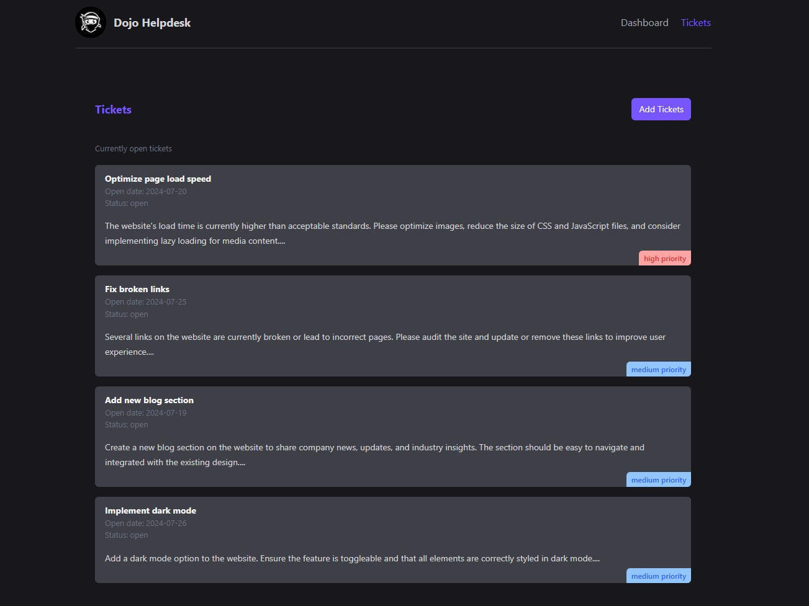

# Dojo Helpdesk

## Overview

Dojo Helpdesk is a ticket management application designed for helpdesk teams to efficiently manage and resolve customer support tickets. This application provides an intuitive interface to create, track, and close support tickets, enhancing productivity and ensuring timely customer service.

[](https://github.com/patriciasegantine/next-shadcn-recipes.git)

---

## 🚧 Project in Development
Please note that this project is currently under active development. Features and functionality may change, and there may be bugs or incomplete implementations. This is a personal project where I am actively training to improve my knowledge of the new features in Next.js 14. I will be regularly updating it as I explore and integrate new features and best practices.

---
## Features

- **Ticket Management**: Create, update, and resolve support tickets.
- **Real-Time Updates**: View ticket statuses in real-time.
- **User-Friendly Interface**: Simple and intuitive UI using React and TailwindCSS.
- **Customizable Workflows**: Adaptable ticket workflows to suit different business needs.

## Installation

To get started with Dojo Helpdesk, follow the steps below:

1. Clone the repository:
   ```bash
   git clone https://github.com/patriciasegantine/next-shadcn-recipes.git
   cd dojo-helpdesk
   ```

2. Install the dependencies:
   ```bash
   npm install
   ```

3. Start the JSON server for mock data:
   ```bash
   npm run json
   ```

4. Start the development server:
   ```bash
   npm run dev
   ```


## Scripts

- `npm run dev`: Starts the development server.
- `npm run build`: Builds the application for production.
- `npm run start`: Starts the production server.
- `npm run json`: Starts a JSON server for mock data at port 5000.

## Technologies Used

- **[Next.js](https://nextjs.org/)**: For server-side rendering and static site generation.
- **[React](https://reactjs.org/)**: For building the user interface.
- **[TailwindCSS](https://tailwindcss.com/)**: For styling the application.
- **[TypeScript](https://www.typescriptlang.org/)**: For type-safe development.
- **[JSON Server](https://github.com/typicode/json-server)**: For mocking API data during development.


## Development

If you'd like to contribute, feel free to open a pull request. Please ensure your code follows the linting and formatting rules specified in the project.

## License

This project is licensed under the MIT License.
